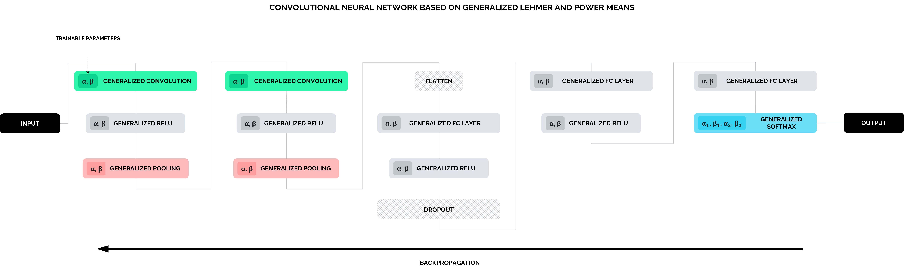
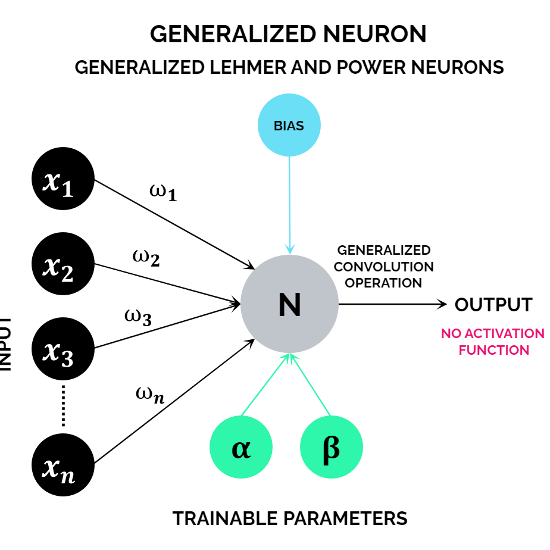

<h1 align="center">Hyper-Flexible Convolutional Neural Networks Based on Generalized Lehmer and Power Means</h1>

<h4 align="center">Vagan Terziyan, Diana Malyk, Mariia Golovianko, Vladyslav Branytskyi</h4>


<p align="center"> [<b><a href="">Paper</a></b>] &emsp; [<b><a href="#citation">Citation</a></b>] </p>

<p align="center">
  
</p>

Abstract: *Convolutional Neural Network is one of the famous members of the deep
learning family of neural network architectures, which is used for many purposes,
including image classification. In spite of the wide adoption, such networks are known
to be highly tuned to the training data (samples representing a particular problem), and
they are poorly reusable to address new problems. One way to change this would be,
in addition to trainable weights, to apply trainable parameters of the mathematical
functions, which simulate various neural computations within such networks. In this
way, we may distinguish between the narrowly focused task-specific parameters
(weights) and more generic capability-specific parameters. In this paper, we suggest a
couple of flexible mathematical functions (Generalized Lehmer Mean and Generalized
Power Mean) with trainable parameters to replace some fixed operations (such as
ordinary arithmetic mean or simple weighted aggregation), which are traditionally used
within various components of a convolutional neural network architecture. We named
the overall architecture with such an update as a hyper-flexible convolutional neural
network. We provide mathematical justification of various components of such
architecture and experimentally show that it performs better than the traditional one,
including better robustness regarding the adversarial perturbations of testing data.*

## Components

### Generalized pooling functions
New types of flexible pooling based on Generalized Lehmer Mean (GLM) and Generalized Power Mean (GPM). Other Lehmer-based pooling types can be found in `flexnets/nn/pooling.py`.

### Generalized convolution
Flexible convolutional layers based on GLM and GPM with adaptive parameters.

Generalized Lehmer Dot Product or Generalized Lehmer Convolution (GLC) and Generalized Power Dot Product or Generalized Power Convolution (GPC) can be found in `flexnets/nn/convolution.py`.

### Flexible/Trainable SoftMax and ReLU activation functions
Generalized ReLU function (GReLU) with extra trainable parameter α and Generalized SoftMax with flexible normalization function (GLSoftMax and GPSoftMax) can be found in `flexnets/nn/activation.py`.

### Generalized Neuron
<p align="center">
  
</p>

Generalized Neuron is a new type of artificial neuron with trainable weights and with two additional parameter. Generalized Lehmer Layer (GLL) can be found in `flexnets/nn/layers.py`.

## Installation
Requirements:

- Python 3.10.6
- PyTorch 1.12.1
- (optional) pandas 1.4.3
- (optional) pytorch-lightning 1.7.0
- (optional) torchmetrics 0.9.3
- (optional) tqdm 4.64.0

## Usage
The package is based on PyTorch and composed of five main parts:
- activation
- convolution
- layers
- pooling
- preprocessing

All components can be used both together and separately in any other network.

### Trainable parameters
```python
# Initial values for trainable parameters of GLM
alpha = 2.5
beta = 1.3

# Initial values for trainable parameters of GPM
gamma = 2.3
delta = 0.5
```
### GeneralizedLehmerPool2d
```python
import flexnets.nn as nn

m = nn.pooling.GeneralizedLehmerPool2d(alpha, beta)
input = torch.randn(20, 16, 50, 100)
output = m(input)
```

### GeneralizedPowerMeanPool2d
```python
import flexnets.nn as nn

m = nn.pooling.GeneralizedPowerMeanPool2d(gamma, delta)
input = torch.randn(20, 16, 50, 100)
output = m(input)
```

### GeneralizedLehmerConvolution
```python
from flexnets.nn.convolution import GeneralizedLehmerConvolution

m = GeneralizedLehmerConvolution(16, 33, (3, 5), stride=(2, 1), padding=(4, 2), dilation=(3, 1), alpha = 1.5, beta = 1.3)
input = torch.randn(20, 16, 50, 100)
output = m(input)
```

### GeneralizedPowerConvolution
```python
from flexnets.nn.convolution import GeneralizedPowerConvolution

m = GeneralizedPowerConvolution(16, 33, (3, 5), stride=(2, 1), padding=(4, 2), dilation=(3, 1), gamma = 1.5, delta = 1.3)
input = torch.randn(20, 16, 50, 100)
output = m(input)
```

### GLSoftMax
```python
import flexnets.nn as nn

m = nn.activation.GLSoftMax()
input = torch.randn(2, 3)
output = m(input)
```

### GPSoftMax
```python
import flexnets.nn as nn

m = nn.activation.GPSoftMax()
input = torch.randn(2, 3)
output = m(input)
```

### GReLU
```python
import flexnets.nn as nn

m = nn.activation.GReLU()
input = torch.randn(2)
output = m(input)
```

### GeneralizedLehmerLayer
```python
import flexnets.nn as nn

m = nn.layers.GeneralizedLehmerLayer(3, 50, alpha = 1.8, beta = 1.3)
input = torch.randn(20, 16, 50, 100)
output = m(input)
```

## Citation
If you use the results presented in this paper or the code from the repository, please cite the relevant [paper]()